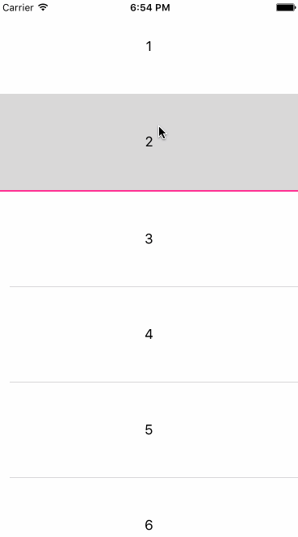

# Requirements

- iOS 9.0+
- Xcode 8+
- Swift 3

# Example




# Usage

```swift
import UIKit
import ExpandingCellTransition

class SampleViewController: UIViewController {

    @IBOutlet var tableView: UITableView!

    var transition:ExpandingCellTransition!

    override func viewDidLoad() {
        super.viewDidLoad()

        // init tableView...
        // ...

        // setup transition. 
        self.transition = ExpandingCellTransition(tableView: self.tableView, duration: 0.5)
    }
}

extension SampleViewController: UITableViewDelegate {

   func tableView(_ tableView: UITableView, didSelectRowAt indexPath: IndexPath) {

        let vc = DetailViewController(nibName: "DetailViewController", bundle: nil)
        vc.number = indexPath.row + 1

        // set transition to a child ViewController.
        vc.transitioningDelegate = self.transition
        self.transition.tappedCellIndex = indexPath

        self.present(vc, animated: true, completion: nil)
    }
}
```

# Installation

## CocoaPods

```ruby
platform :ios, '9.0'
use_frameworks!

pod 'ExpandingCellTransition', git: 'https://github.com/hmuronaka/ExpandingCellTransition.git'
```

